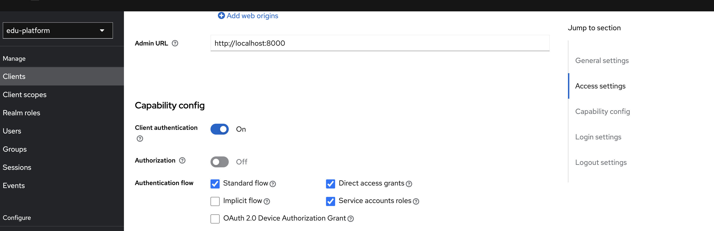
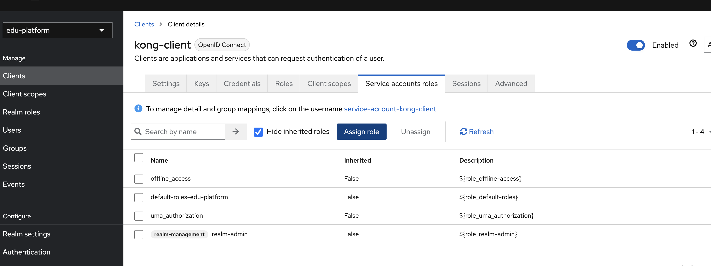

/edu-platform/
├── docker-compose.yml
├── UserService/
│   ├── UserService.csproj
│   ├── Dockerfile
│   └── ...
├── .devcontainer/
│   └── devcontainer.json (isteğe bağlı, tüm yapıyı kontrol edebilir)

dotnet new webapi --name UserService

🌉 Kong Gateway’in Rolü
Ne yapar?	                            Nasıl?
API’lere gelen istekleri yönlendirir	Route tanımlarıyla
Token doğrulama (OIDC) yapar	        Keycloak ile OIDC plugin
Rate Limiting / Logging / Monitoring	Plugin’lerle
Merkezi erişim kontrolü sağlar	        Role-based access ile OIDC üzerinden

🧱 Yapımız: Kong + Keycloak + UserService
[Client]
   ↓
[Kong Gateway] ──> [UserService]
         │
         └──> [Keycloak] (OIDC doğrulama)

# bunu herşeyden önce bir kez çalıştırmak lazım.
docker compose run --rm kong kong migrations bootstrap
Bu komut:
kong servisini tek seferlik çalıştırır
Veritabanını ilk kez yapılandırır (tabloları, şemaları oluşturur)
İş bitince konteyneri temizler (--rm)

1. Kong’a UserService tanıt (Service)
curl -i -X POST http://localhost:8001/services \
  --data name=user-service \
  --data url=http://user-service:5000

 2. Route tanımla: (Kong'a /users çağrısı gelirse yönlendir)
curl -i -X POST http://localhost:8001/services/user-service/routes \
  --data 'paths[]=/users'

✅ 1. Keycloak’ta Bir Client Oluştur ( Önce yeni bir Realm oluştur:  edu-platform )
http://localhost:8080 → Keycloak Admin Paneline git
Realm: edu-platform (veya adını sen belirlediysen onu seç)

Clients > Create
Bilgiler:
Client ID: kong-client
Client type: OpenID Connect
Client authentication: ✅ Enabled (bu önemli)

        Eski Terim (v21 ve öncesi)	Yeni Terim (v22+)	Anlamı
        confidential	✅ Client authentication on	Client ID + Secret ile erişim
        public	❌ Client authentication off	Sadece Client ID yeterli

Valid Redirect URIs: http://localhost:8000/*
Base URL: http://localhost:8000
Root URL: http://localhost:8000

Save

/// enterprise değilsen bu step'i atla
2. Kong’a OIDC Plugin Ekle
curl -i -X POST http://localhost:8001/services/user-service/plugins \
  --data name=openid-connect \
  --data config.issuer=http://keycloak:8080/realms/edu-platform \
  --data config.client_id=kong-client \
  --data config.client_secret=i6l6sEGhquh1xzVEgHGBG4x2UVOrtUdY \
  --data config.scopes=openid,email,profile \
  --data config.redirect_uri=http://localhost:8000/callback \
  --data config.response_type=code \
  --data config.session_secret=changeme123

client_secret bilgisi: Keycloak UI → Clients → kong-client → Credentials sekmesinden alabilirsin
openid-connect plugin’i sadece Kong Gateway Enterprise Edition'da çalışır.

3. Şu anda Community Edition kullanıyorsun (open-source).
[Client] ── Authorization: Bearer <AccessToken> ──▶ [Kong JWT Plugin] ──▶ [UserService]
                                          ▲
                                  Token Issuer: Keycloak
Tarayıcıdan şuna git:
http://localhost:8080/realms/edu-platform

JSON dökümanı gelecek → içinde şunu bul: "public_key"

Örnek: 
{"realm":"edu-platform","public_key":"MIIBIjANBgkqhkiG9w0BAQEFAAOCAQ8AMIIBCgKCAQEA15gtOhj0z0hFma1xXiKX8ve/xzuwlIKbAj1GkuCDmjtNRswouBoodTVq6n78gJFULQZFxC07Z3TNva5ccUtSSbxJtKkHKR6FyEqmUtnpt1P+8I6B/NLRZNJGvEslVlBwESDcQehO2MAxT+5j0M9OGmDjaISgYfe9guaNPLIOHA/B9Q9VsM8viUPDqtLTGvV+Oxa1exaJJPfme9F+sZVTkvtaneR7UAQGOxSjZHTwa7ILiCbS8i8wZzYeeAO+rjcfTia6gZF+OoUvL+18DXNQNPW4BvZvE7i4pQ74cp6ykfcEBvU7xvmJobn6KPULiWcoqrU1W14ZdPUvmBPj92ioFQIDAQAB","token-service":"http://localhost:8080/realms/edu-platform/protocol/openid-connect","account-service":"http://localhost:8080/realms/edu-platform/account","tokens-not-before":0}

Örnek 2: 
{"realm":"edu-platform","public_key":"MIIBIjANBgkqhkiG9w0BAQEFAAOCAQ8AMIIBCgKCAQEA5sBjyrUDwrWLkAmrvqPuSfsB2JjGdBV0Cw4e+0ddyIuFrdEa8OG+2h5AByz4lzb6ZwNFfth6OTd2vJCujqJyq9ms4ZPsCE1k6C2FZCWEUm9xwW7p94FIMawcJ9/98YMCvCYtWt85jCDSLuMfyi/QSv9DqjQP38DwbX8oduriJIQpB9F7IlqK40oXXApVQMSKReLLzWx01Yv6n/rC6IV9yzj7COrPzx5loXFS6OZdP39EM83B88b1dV2L66IxYsjIUj9DS5FRNFm64HmrMcKCkBKgRhBtqJ8rxfu38RJpgxVSHAjjRUDs9IFgp3pisuxdaWWDc1fJHNI2K2+75chxQwIDAQAB","token-service":"http://localhost:8080/realms/edu-platform/protocol/openid-connect","account-service":"http://localhost:8080/realms/edu-platform/account","tokens-not-before":0}

Bu RSA Public Key (modül)’dür. Ama Kong PEM formatında ister. Public Key’i PEM formatına dönüştür. Aşağıdaki gibi

-----BEGIN PUBLIC KEY-----
MIIBIjANBgkqhkiG9w0BAQEFAAOCAQ8AMIIBCgKCAQEA15gtOhj0z0hFma1xXiKX8ve/xzuwlIKbAj1GkuCDmjtNRswouBoodTVq6n78gJFULQZFxC07Z3TNva5ccUtSSbxJtKkHKR6FyEqmUtnpt1P+8I6B/NLRZNJGvEslVlBwESDcQehO2MAxT+5j0M9OGmDjaISgYfe9guaNPLIOHA/B9Q9VsM8viUPDqtLTGvV+Oxa1exaJJPfme9F+sZVTkvtaneR7UAQGOxSjZHTwa7ILiCbS8i8wZzYeeAO+rjcfTia6gZF+OoUvL+18DXNQNPW4BvZvE7i4pQ74cp6ykfcEBvU7xvmJobn6KPULiWcoqrU1W14ZdPUvmBPj92ioFQIDAQAB
-----END PUBLIC KEY-----

    Kong’da Consumer Tanımla
    curl -i -X POST http://localhost:8001/consumers \
          --data username=keycloak-user

Kong’a JWT Credential Ekle (Keycloak public key ile)

curl -i -X POST http://localhost:8001/consumers/keycloak-user/jwt \
  --data "algorithm=RS256" \
  --data "rsa_public_key=-----BEGIN PUBLIC KEY-----\nMIIBIjANBgkqhkiG9w0BAQEFAAOCAQ8AMIIBCgKCAQEA15gtOhj0z0hFma1xXiKX8ve/xzuwlIKbAj1GkuCDmjtNRswouBoodTVq6n78gJFULQZFxC07Z3TNva5ccUtSSbxJtKkHKR6FyEqmUtnpt1P+8I6B/NLRZNJGvEslVlBwESDcQehO2MAxT+5j0M9OGmDjaISgYfe9guaNPLIOHA/B9Q9VsM8viUPDqtLTGvV+Oxa1exaJJPfme9F+sZVTkvtaneR7UAQGOxSjZHTwa7ILiCbS8i8wZzYeeAO+rjcfTia6gZF+OoUvL+18DXNQNPW4BvZvE7i4pQ74cp6ykfcEBvU7xvmJobn6KPULiWcoqrU1W14ZdPUvmBPj92ioFQIDAQAB\n-----END PUBLIC KEY-----"

  postman'de hata alınabilir.
  cat > keycloak_pub.pem <<EOF
-----BEGIN PUBLIC KEY-----
MIIBIjANBgkqhkiG9w0BAQEFAAOCAQ8AMIIBCgKCAQEA15gtOhj0z0hFma1xXiKX8ve/xzuwlIKbAj1GkuCDmjtNRswouBoodTVq6n78gJFULQZFxC07Z3TNva5ccUtSSbxJtKkHKR6FyEqmUtnpt1P+8I6B/NLRZNJGvEslVlBwESDcQehO2MAxT+5j0M9OGmDjaISgYfe9guaNPLIOHA/B9Q9VsM8viUPDqtLTGvV+Oxa1exaJJPfme9F+sZVTkvtaneR7UAQGOxSjZHTwa7ILiCbS8i8wZzYeeAO+rjcfTia6gZF+OoUvL+18DXNQNPW4BvZvE7i4pQ74cp6ykfcEBvU7xvmJobn6KPULiWcoqrU1W14ZdPUvmBPj92ioFQIDAQAB
-----END PUBLIC KEY-----
EOF

cat > keycloak_pub.pem <<EOF
-----BEGIN PUBLIC KEY-----
MIIBIjANBgkqhkiG9w0BAQEFAAOCAQ8AMIIBCgKCAQEA5sBjyrUDwrWLkAmrvqPuSfsB2JjGdBV0Cw4e+0ddyIuFrdEa8OG+2h5AByz4lzb6ZwNFfth6OTd2vJCujqJyq9ms4ZPsCE1k6C2FZCWEUm9xwW7p94FIMawcJ9/98YMCvCYtWt85jCDSLuMfyi/QSv9DqjQP38DwbX8oduriJIQpB9F7IlqK40oXXApVQMSKReLLzWx01Yv6n/rC6IV9yzj7COrPzx5loXFS6OZdP39EM83B88b1dV2L66IxYsjIUj9DS5FRNFm64HmrMcKCkBKgRhBtqJ8rxfu38RJpgxVSHAjjRUDs9IFgp3pisuxdaWWDc1fJHNI2K2+75chxQwIDAQAB
-----END PUBLIC KEY-----
EOF

curl -i -X POST http://localhost:8001/consumers/keycloak-user/jwt \
  --data "algorithm=RS256" \
  --data "key=http://localhost:8080/realms/edu-platform" \
  --data-urlencode "rsa_public_key@keycloak_pub.pem"

curl -i -X POST http://localhost:8001/services/user-service/plugins \
  --data "name=jwt"

 token almayı dene
curl -X POST http://localhost:8080/realms/edu-platform/protocol/openid-connect/token \
  -H "Content-Type: application/x-www-form-urlencoded" \
  -d "grant_type=password" \
  -d "client_id=kong-client" \
  -d "client_secret=<YOUR_CLIENT_SECRET>" \
  -d "username=demo.user" \
  -d "password=Password123!"

 token'ı test et.
curl http://localhost:8000/users/weatherforecast \
  -H "Authorization: Bearer <access_token>"

✅ Şu ana kadar neler yaptık ve neden yaptık?
🔐 1. Keycloak Kurulumu
🔸 Neden?
Keycloak, sistemimizde kimlik doğrulama ve yetkilendirme (login, logout, token üretimi, kullanıcı yönetimi) sağlayan bir Identity Provider (IdP).

🧱 2. Keycloak içinde Realm oluşturduk
🔸 Neden?
Bir realm, Keycloak içinde izole bir kullanıcı alanıdır.

➕ Kendi kullanıcıları, rolleri, client’ları olur
➕ Multi-tenant destekler (örneğin: her okul veya şirket bir realm olabilir)

Özetle:

Realm = mini bir authentication evreni

🧑‍💻 3. Client oluşturduk
🔸 Neden?
Bir client, bir uygulamayı temsil eder.
Mesela kong-client → Kong’un login olmak için kullandığı client

Her client:

Token almak için tanımlıdır

Redirect URI, secret, grant types gibi ayarları olur

🌉 4. Kong Kurulumu + Konfigürasyon
🔸 Neden?
Kong bizim API Gateway’imiz. Ne işe yarıyor?

Özellik	Açıklama
Routing	/users → UserService
Authentication	Token kontrolü (JWT plugin)
Rate Limiting	(ileride eklenebilir)
Logging / Monitoring	(plugin’lerle eklenebilir)
Kong’a:

user-service adında bir service tanımladık

/users gibi endpoint’lere yönlendiren route oluşturduk

🔐 5. Kong → JWT Plugin Kurduk
🔸 Neden?
Kong Community Edition’da OIDC plugin yoktu.
Biz de Keycloak’tan gelen access_token (JWT) ile authentication yapmak için JWT plugin kullandık.

Bunun için:

Kong'a bir consumer (keycloak-user) ekledik

Ona Keycloak’ın public RSA key’ini tanıttık

JWT içindeki iss alanına göre eşleştirme yaptık (key=iss)

🤔 Peki şimdi UserService'e ne kaldı?
Harika soru.
Eğer Keycloak zaten kullanıcı yönetimini yapıyorsa…

❌ Ne yapmamalıyız?
Şifre saklamak

Login olmak

Token üretmek

→ Bunlar Keycloak’ın işi

✅ Ne yapmalıyız?
UserService, uygulamaya özel kullanıcı verilerini saklar. Örnekler:

Alan	Açıklama
Kullanıcının eğitim düzeyi	ilkokul, lise, üniversite
Kullanıcının etiketleri	“matematik seven”, “öğrenci temsilcisi” vs.
Kullanıcının sistem içi rolü	Öğrenci, Öğretmen, Veli (Keycloak rolüyle eşleştirilebilir)
Kullanıcının puanı	Ödev çözüm puanı, başarı skoru
Kullanıcının çalışma istatistiği	Kaç test çözdü, başarısı nedir vs.
UserService, Keycloak’taki kullanıcıyı kendi veritabanında referans olarak tutar:
Örneğin: sub veya user_id → Keycloak token’dan gelir, biz DB'de bu id ile kullanıcıyı tutarız.

📌 Yani Roller Şöyle:
Sistem	Sorumluluğu
Keycloak	Kimlik doğrulama, kullanıcı oluşturma, login, token üretme
Kong	Erişim kontrolü, token doğrulama, API yönlendirme
UserService	Uygulamaya özgü kullanıcı profili ve davranış yönetimi
🔄 Örnek Akış
Kullanıcı Keycloak’ta kayıt olur (veya admin ekler)

Token alır (access_token)

Frontend bu token’la GET /users/me gibi bir isteği Kong’a yollar

Kong token’ı doğrular → UserService’e yönlendirir

UserService sub’dan gelen kullanıcıyı bulur → profilini döner

#######################

🎯 Keycloak ve UserService İlişkisi:
Kullanıcı Kimliği:

Keycloak, kullanıcıları ID ile tanımlar. Bu ID, her kullanıcı için benzersizdir ve UserService'te bir kullanıcının Keycloak'taki kimliğini temsil eder.

Eğer UserService ve Keycloak arasında bir entegre bağlantı kuruyorsanız, her kullanıcının Keycloak'taki kimliği (ID'si)'ne ihtiyacınız olur.

Veritabanı Yönetimi:

UserService'teki veritabanı genellikle kullanıcı profilleri, kullanıcı bilgileri gibi verileri tutar.

Ancak, Keycloak'ta, kimlik doğrulama ve kullanıcı yönetimi gibi işlemler yapılır.

Bu durumda, UserService'teki User tablosunda, kullanıcıların Keycloak'taki kimlik bilgilerini tutmanız, her iki sistemin entegre şekilde çalışmasını sağlar.

💡 KeycloakId'nin Kullanılma Amacı:
Kullanıcı Yönetimi:

Kullanıcı kaydı yaparken, Keycloak’ta yeni bir kullanıcı oluşturduğunda, bu kullanıcının ID'sini alırsınız.

UserService'te, bu kullanıcıyı KeycloakId ile eşleştirirsiniz.

Eğer bir kullanıcı tekrar giriş yaparsa, JWT token içerisindeki KeycloakId'yi kullanarak UserService veritabanındaki doğru kullanıcıyı bulabilirsiniz.

Kullanıcı Takibi:

UserService'te, sadece UserService'teki verilerle çalışmak yerine, Keycloak'ta doğrulanan bir kullanıcıyı takip edebilmek için bu ID'yi saklarsınız.

Bu KeycloakId, kullanıcıların şifre sıfırlama veya profil güncellemeleri gibi işlemler için Keycloak ile senkronize olmanıza olanak tanır.

🎯 Örnek Senaryo:
Bir kullanıcı POST /register ile kaydoldular.

Keycloak’a kullanıcı kaydedildi ve Keycloak’tan bir KeycloakId aldık.

Bu KeycloakId, UserService'teki User tablosuna eklenir, böylece UserService'teki kullanıcılar ile Keycloak’taki kullanıcılar arasında ilişki kurulmuş olur.

Kullanıcı bir sonraki girişinde, JWT token'daki KeycloakId ile UserService'teki doğru kullanıcı bilgilerini alabiliriz.

###############

yarattığımız kong-client'ın ServiceAccount'una gidip, service accounts roles checkini işaretler

sonra Serivice account Rollerden Assign Role deyip, Client'a göre filtrele deyip, realm admin yap.
